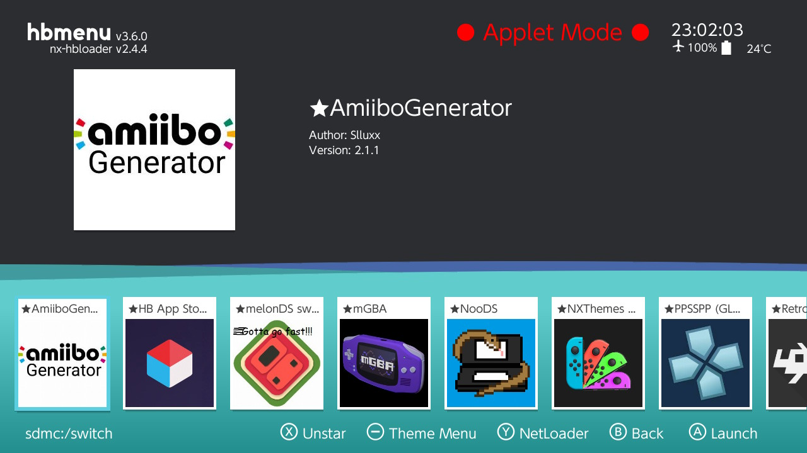

# Switch Jailbreak

Welcome to the **Switch Jailbreak** repository. This project is intended to provide tools, resources, and instructions for users interested in exploring homebrew development and advanced customization of their Nintendo Switch consoles.

> **Disclaimer**: Jailbreaking your Nintendo Switch may void your warranty and expose your console to security risks. Use these resources at your own discretion. This repository is for educational purposes only.

---

## Features

- Detailed guides for jailbreaking your Switch console.
- Resources for setting up a homebrew environment.
- Tools and scripts to assist in the jailbreak process.
- Updates and patches for enhanced functionality.

---

## End Result

 

In both pictures, there is an example of the Nintendo Switch after the installation. As you can see, it has a custom theme and access to install various apps, such as emulators.

---

## Getting Started

### Prerequisites

Before proceeding, ensure you have:

1. A Nintendo Switch console with a compatible firmware version.
2. A microSD card (32GB or larger recommended).
3. A USB-C cable to connect your console to a PC.
4. A Windows, macOS, or Linux PC with administrative access.

### Step-by-Step Instructions

1. **Check Compatibility**: Verify your Nintendo Switch firmware version is compatible with the jailbreak tools in this repository.
2. **Download Required Files**: Clone this repository and download the necessary tools from the `tools` directory:

   ```bash
   git clone https://github.com/GoncaloP0710/Switch_Jailbreak.git
   ```

3. **Follow the Guide**: Visit [switch.hacks.guide](https://switch.hacks.guide/) and follow the detailed instructions provided on the site to prepare your console for jailbreaking.

---

## Contributing

Contributions are welcome! If you have tools, updates, or improvements to share, feel free to open an issue or submit a pull request.

1. Fork the repository.
2. Create a new branch for your changes:

   ```bash
   git checkout -b feature/your-feature
   ```

3. Commit your changes:

   ```bash
   git commit -m "Add your message here"
   ```

4. Push to your branch and submit a pull request.

---

## License

This project is licensed under the MIT License. See the [LICENSE](LICENSE) file for more details.

---

## Disclaimer

This repository is for **educational purposes only**. The authors are not responsible for any damage or legal issues resulting from the use of these tools or guides.

---

## Support

For support or questions, please open an issue in this repository or contact the maintainer directly via the repository's GitHub page.
